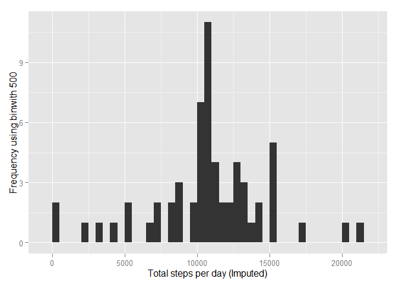

# PA1_template.Rmd
Nitheesh Panicker  
Wednesday, August 12, 2015  

# Reproducible Research: Peer Assessment 1


```r
library(ggplot2)
library(Hmisc)
```

```
## Loading required package: grid
## Loading required package: lattice
## Loading required package: survival
## Loading required package: Formula
## 
## Attaching package: 'Hmisc'
## 
## The following objects are masked from 'package:base':
## 
##     format.pval, round.POSIXt, trunc.POSIXt, units
```

```r
library(scales)
library(knitr)
```
=======================================  
 Loading and preprocessing the data    
=======================================  
  
Step 1. Load the data (i.e. read.csv())      


```r
setwd("~/R/Reproducible Research")
if(!file.exists('activity.csv')){
    unzip('repdata-data-activity.zip')
}
activityData <- read.csv('activity.csv')
```

Step 2. Process/transform the data (if necessary) into a format suitable for your analysis  


```r
#activityData$interval <- strptime(gsub("([0-9]{1,2})([0-9]{2})", "\\1:\\2", activityData$interval), format='%H:%M')
```

=====================================================  
 What is mean total number of steps taken per day?  
=====================================================  


Step 1.Calculate the total number of steps taken per day  


```r
stepsPerDay <- tapply(activityData$steps, activityData$date, sum, na.rm=TRUE)
```

Step 2. Make a histogram of the total number of steps taken each day  


```r
qplot(stepsPerDay, xlab='Total steps per day', ylab='Frequency using binwith 500', binwidth=500)
```

 

Step 3. Calculate and report the mean and median total number of steps taken per day  


```r
stepsPerDayMean <- mean(stepsPerDay)
stepsPerDayMedian <- median(stepsPerDay)
```
* Mean: 9354.2295082
* Median:  10395

=====================================================  
 What is the average daily activity pattern?  
=====================================================  

```r
avgStepsPerTimeBlock <- aggregate(x=list(meanSteps=activityData$steps), by=list(interval=activityData$interval), FUN=mean, na.rm=TRUE)
```

Step 1. Make a time series plot  


```r
ggplot(data=avgStepsPerTimeBlock, aes(x=interval, y=meanSteps)) +
    geom_line() +
    xlab("5 Min interval") +
    ylab("Avg number of steps taken") 
```

 

Step 2. Which 5-minute interval, on average across all the days in the dataset, contains the maximum number of steps?  


```r
mostSteps <- which.max(avgStepsPerTimeBlock$meanSteps)
timeMostSteps <-  gsub("([0-9]{1,2})([0-9]{2})", "\\1:\\2", avgStepsPerTimeBlock[mostSteps,'interval'])
```

* Most Steps at: 8:35

=====================================================  
 Imputing missing values  
=====================================================    

Step 1. Calculate and report the total number of missing values in the dataset   


```r
numMissingValues <- length(which(is.na(activityData$steps)))
```

* Number of missing values: 2304

Step 2. Devise a strategy for filling in all of the missing values in the dataset.  

Step 3. Create a new dataset that is equal to the original dataset but with the missing data filled in.  


```r
activityDataImputed <- activityData
activityDataImputed$steps <- impute(activityData$steps, fun=mean)
```


Step 4. Make a histogram of the total number of steps taken each day 


```r
stepsByDayImputed <- tapply(activityDataImputed$steps, activityDataImputed$date, sum)
qplot(stepsByDayImputed, xlab='Total steps per day (Imputed)', ylab='Frequency using binwith 500', binwidth=500)
```

 

... and Calculate and report the mean and median total number of steps taken per day.   


```r
stepsByDayMeanImputed <- mean(stepsByDayImputed)
stepsByDayMedianImputed <- median(stepsByDayImputed)
```
* Mean (Imputed): 1.0766189\times 10^{4}
* Median (Imputed):  1.0766189\times 10^{4}

==========================================================================================================  
 Are there differences in activity patterns between weekdays and weekends?  
==========================================================================================================  
Step 1. Create a new factor variable in the dataset with two levels - "weekday" and "weekend" indicating whether a given date is a weekday or weekend day.  


```r
activityDataImputed$dateType <-  ifelse(as.POSIXlt(activityDataImputed$date)$wday %in% c(0,6), 'weekend', 'weekday')
```
------------------------------------------------------  
Step 2. Make a panel plot containing a time series plot  
------------------------------------------------------  

```r
averagedActivityDataImputed <- aggregate(steps ~ interval + dateType, data=activityDataImputed, mean)
ggplot(averagedActivityDataImputed, aes(interval, steps)) + 
    geom_line() + 
    facet_grid(dateType ~ .) +
    xlab("5 Min interval") + 
    ylab("Avg number of steps")
```

 
